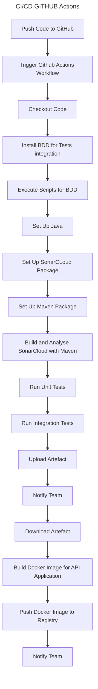

# Projet de démonstration dans le cadre de la formation CDA

> ce projet a pour objectif d'utiliser le framework Springboot, de mettre en place une API interconnecté à 
> une base de données MySQL

> Cette API servira ensuite à un 2eme projet Springboot orienté web pour manipuler et afficher les données de la 
> base de données.


- utilisation de DTO.
- Utilisation d'un coffre fort pour la gestion des données sensibles. (Infisical)
- Mise en place d'un CI/CD avec GitHub Actions :



## notes de travail : 
### sous intellij

> IntelliJ :
> - charge souvent le .env comme variables d’environnement (via la config de run)
> - ou ton plugin / lib .env lit le fichier présent sur le filesystem
  
👉 Donc au runtime, les variables existent.

# Dans un JAR 
> Quand tu fais :

```java
java -jar app.jar
```
- le .env n’existe plus sur le filesystem
- un JAR est une archive fermée
- Spring ne lit pas les .env par défaut
  
- Donc :
  - ❌ variables absentes 
  - ❌ @Value("${...}") → null 
  - ❌ crash ou config invalide

- Règle importante (bonne pratique)

👉 Les secrets ne doivent PAS être dans le JAR

Un JAR doit être :
 - portable
 - sans secrets
 - configurable depuis l’extérieur

Spring est conçu exactement pour ça.

# Solution
Windows (PowerShell)
```java
Get-Content .env | ForEach-Object {
  $name, $value = $_ -split '='
  setx $name $value
}

java -jar app.jar
```

# Dans Spring
spring.datasource.password=${DB_PASSWORD}
- ✔️ propre
- ✔️ sécurisé
- ✔️ standard prod / docker / cloud